# Verification

## 1. Overview

This document verifies the successful implementation of the enterprise campus network. Validation was performed using Cisco IOS operational commands, connectivity tests, and failover testing to confirm that the network functions as designed.

The verification process covers routing, redundancy, Layer 2 and Layer 3 services, IP address allocation, Internet connectivity, and ISP failover.

# 2. OSPF Verification

## Objective

Verify that OSPF neighbor adjacencies are successfully established and that routes are exchanged between all Layer 3 devices.

## Commands

show ip ospf neighbor
show ip route

## Result

All OSPF neighbors successfully formed FULL adjacencies, confirming stable routing relationships throughout the routed infrastructure. The routing tables contain the expected OSPF-learned routes, demonstrating successful route propagation across the enterprise network.

## Evidence

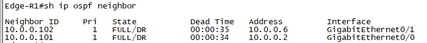
.png)

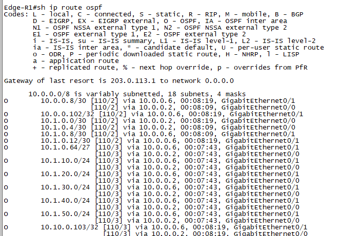

# 3. HSRP Verification

## Objective

Verify gateway redundancy, load sharing, and automatic recovery.

## Commands

show standby brief

## Result

HSRP was successfully configured on all user VLANs.

HSRP priorities were adjusted so that each distribution switch serves as the Active gateway for selected VLANs while acting as the Standby gateway for others. This distributes gateway processing across both switches during normal operation.

Failure testing confirmed that when the Active switch becomes unavailable, the Standby switch immediately assumes the gateway role. Upon restoration, HSRP preemption allows the preferred switch to automatically resume its Active role.

## Evidence

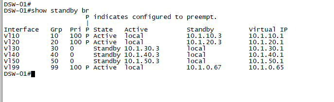

# 4. EtherChannel Verification

## Objective

Verify successful operation of the Layer 3 EtherChannel connecting the core switches.

## Commands

show etherchannel summary

## Result

The Layer 2 & 3 EtherChannel formed successfully with configured member links participating in the bundle. 

## Evidence

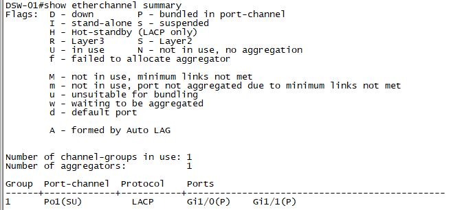
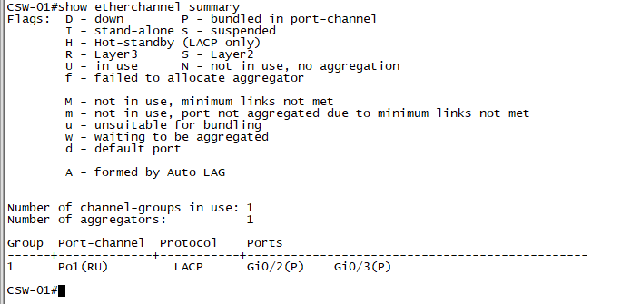

# 5. DHCP Verification

## Objective

Verify dynamic IP address allocation for client devices.

## Commands

show ip dhcp binding

## Result

Client devices successfully received IP addresses, subnet masks, and default gateway information from the DHCP server hosted on the edge router.

DHCP address bindings confirm successful allocation within the configured address pools.

## Evidence

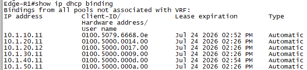

# 6. NAT Verification

## Objective

Verify successful Network Address Translation (NAT) through both Internet Service Providers.

## Commands

show ip nat translations
show ip nat statistics

## Result

Dynamic NAT translations were successfully created for internal hosts accessing external networks.

Route-map-based NAT was implemented to ensure translations occur through the correct outside interface based on the active ISP. During failover testing, new translations were successfully created through the secondary ISP, maintaining Internet connectivity without requiring manual intervention.

## Evidence

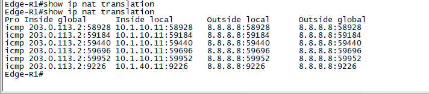

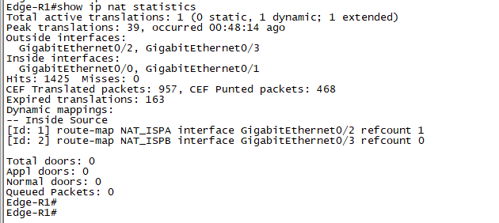

# 7. ISP Failover Verification

## Objective

Verify continued Internet connectivity during failure of the primary ISP.

## Test Procedure

1. Verify Internet connectivity through the primary ISP.
2. Simulate failure of the primary ISP connection.
3. Confirm routing convergence.
4. Verify Internet connectivity through the secondary ISP.
5. Restore the primary ISP connection.
6. Confirm restoration of normal operation.

## Result

The edge router successfully detected the loss of the primary ISP and redirected outbound traffic through the secondary ISP.

Because NAT was configured using route maps, new address translations were created through the active outside interface, ensuring uninterrupted Internet access throughout the failover event.

When the primary ISP was restored, normal operation resumed automatically.

## Evidence

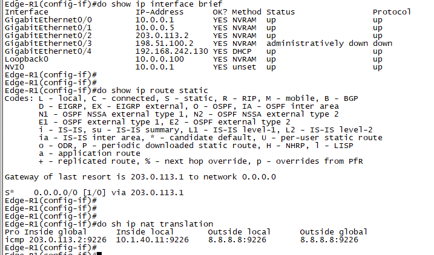

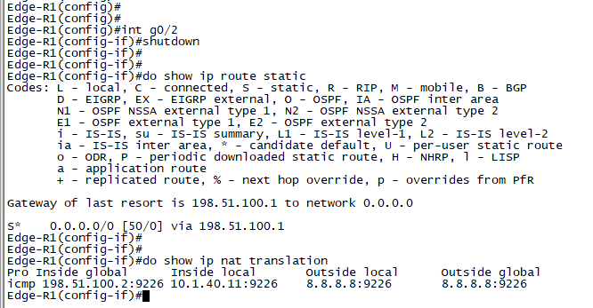

# 8. End-to-End Connectivity

## Objective

Verify communication across the enterprise network.

## Validation

The following connectivity tests were successfully completed:

* Client to default gateway
* Inter-VLAN communication
* Client to local servers
* Client to Internet
* Management network connectivity

## Evidence

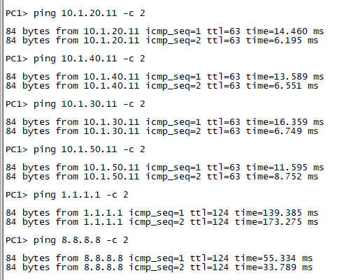
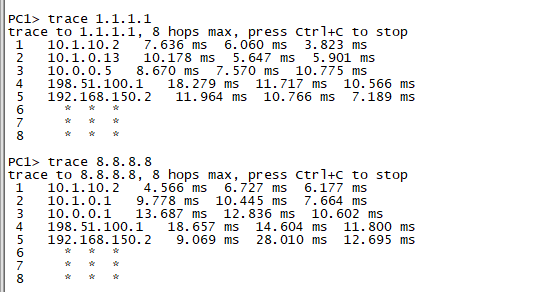

# 9. Verification Summary

The enterprise campus network was successfully validated against the project objectives.

The verification process confirmed:

* Successful OSPF neighbor establishment and route exchange.
* Stable HSRP operation with VLAN load sharing, automatic failover, and preemption.
* Operational Layer 3 EtherChannel providing redundancy between the core switches.
* Successful DHCP address allocation.
* Correct NAT operation using route maps for dual ISP environments.
* Automatic ISP failover while maintaining Internet connectivity.
* Successful end-to-end communication across all implemented network services.

The verification results demonstrate that the implemented design provides a resilient, scalable, and highly available enterprise campus network suitable for the current project requirements.
